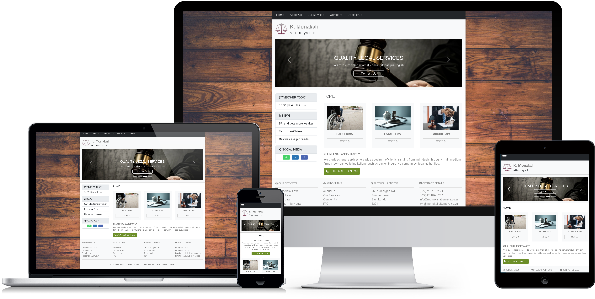

# K. Monakali Attorneys .inc

 
# Table of contents
- [Introduction](#introduction)
- [Environment](#environment)
- [Tech Stack](#tech-stack)
- [How to run the template](#how-to-run-the-template)
- [References](#references)
- [Licence](#licence)


# Introduction

Mobile-friendly `Angular 2+` website developed using lazy-loading approach to enhance site-performance. CSS Grid-layout and Flexbox models were used to design responsive UI. 

[Back to top](#table-of-contents)

# Environment

- Operating System - Windows 11
- Angular CLI - v17.3.10
- Visual Studio Code
- Node.js - v20.11.1
- GitHub & Git Bash

[Back to top](#table-of-contents)

# Tech stack
- Responsive Web Design (HTML5, SCSS, Bootstrap5, FontAwesome, Lazy-loading)
- Angular/Typescript framework - v17.3.10
- Google Maps
- RESTful APIs Integration

[Back to top](#table-of-contents)

# How to run the template

### 1. Installation
Ensure that you have following items are installed in your computer:

- Visual Studio Code
- Node.js
- Angular CLI
- GitHub & Git Bash

### 2. Clone `GitHub` repository

Clone the project from Github repository into your local repository:  [ prj-angular-masterpage ](https://github.com/mystackbox/prj-angular-masterpage). For more information about how to clone the GitHub repository, see [Cloning GitHub repository](https://docs.github.com/en/repositories/creating-and-managing-repositories/cloning-a-repository).


### 3. Start the Localhost server

Run the following command in your `CLI` to install all the rrequired packages:
```javascript
npm install
```
Run the following command in your `CLI` to start the `localhost` server.
```javascript
ng serve
``` 
Once the `localhost` server is running, navigate to `http://localhost:4200/` or copy/paste `http://localhost:4200/` in your browser address-bar, then press enter. 


[Back to top](#table-of-contents)

# References

- For more information related to Angular setup, please check out the [Angular documentation](https://angular.io/docs) page.
- For more information related to Angular CLI, please check out the [Angular CLI Overview and Command Reference](https://angular.io/cli) page.
- For more information related to Node.js, please check out the [Introduction to Node.js](https://nodejs.org/en/learn/getting-started/introduction-to-nodejs) page.
- For more information related to Node Package Manager (NPM), please check out the [npm Docs](https://docs.npmjs.com/) page.


[Back to top](#table-of-contents)

# Licence

Copyright (c) 2024 | Yingisani


